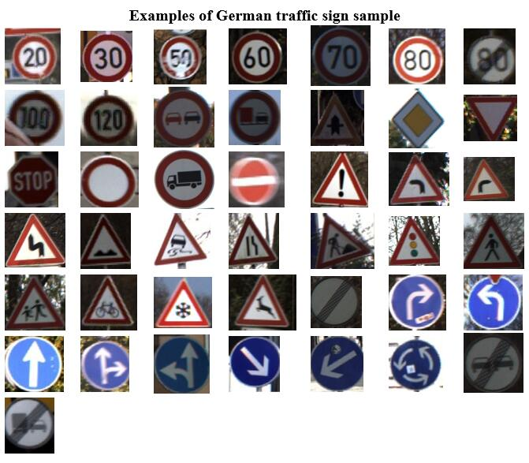
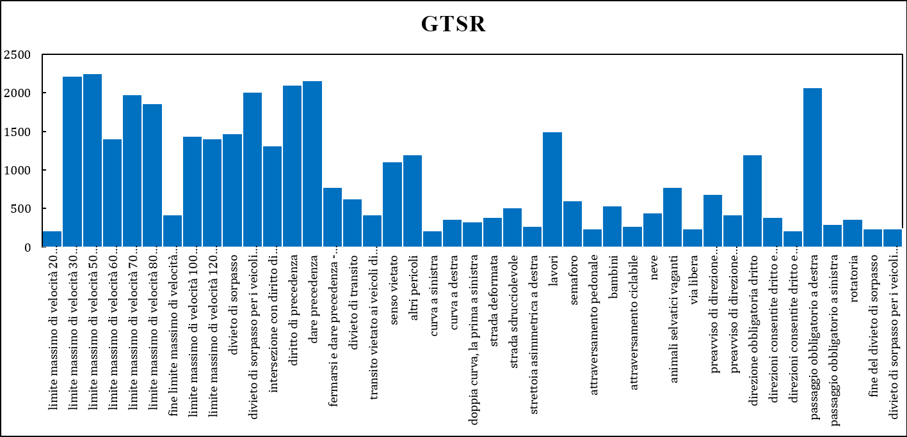
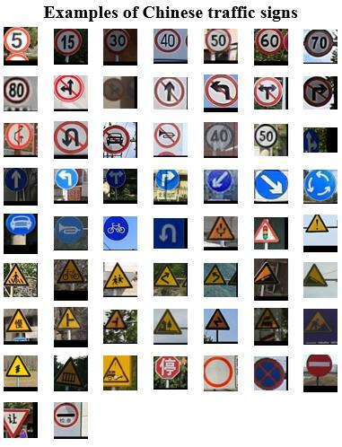
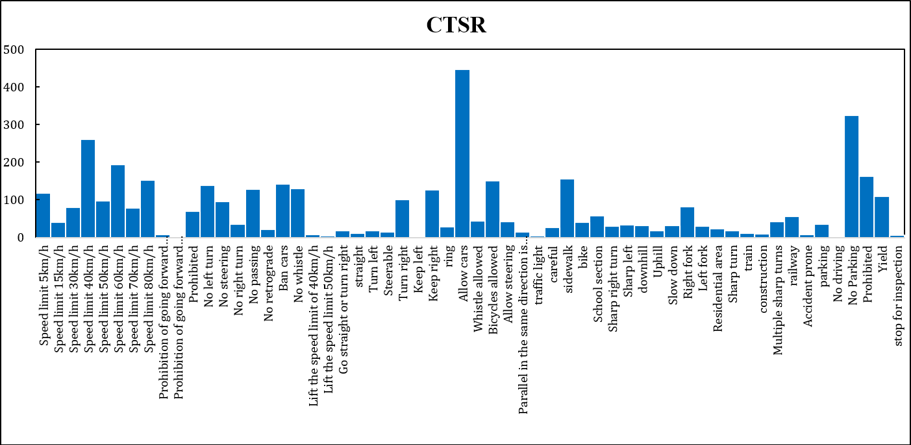

# Traffic Sign Recognition Dataset for Zero-Shot Learning
## Overview
We propose two datasets for zero-shot learning in the traffic sign recognition field based on **German Traffic Sign Recognition Baseline** (**GTSRB**) and **Chinese Traffic Sign Database** (**CTSD**).

## Standard
We summarized the following characteristics as the basis for attribute descriptions based on the observations of German and Chinese traffic laws and traffic signs samples.
### Sign category
-  **Warning signs**: signs that warn vehicles and pedestrians to pay attention to road traffic.
-  **Prohibition signs**: signs prohibiting or restricting the passage of vehicles and pedestrians.
-  **Indication signs**: indicating signs that vehicles and pedestrians should follow.
-  **Directional signs**: signs that convey road direction, location, and distance information.
-  **Tourist area signs**: provide signs of the direction and distance of tourist attractions.
-  **Operation area sign**: a sign for traffic in the road operation area.
-  **Notice signs**: signs that inform off-road facilities, safe driving information and other information.
-  **Auxiliary label**: attached to the main logo, it is a logo for auxiliary explanation.

### Color
-  **Red**: indicates prohibition, stop, and danger. It is used for the borders, background colors, and slashes of prohibition signs, as well as crosses and slash symbols, and the background colors of warning linear guide signs.
-  **Yellow or fluorescent yellow**: indicates warning, used as the background color of warning signs.
-  **Blue**: indicates instructions and follow, and is used for the background color of indication signs; indicates driving information such as place names, routes, directions, etc., and is used as the background color of general road guidance signs.
-  **Green**: indicates driving information such as place name, route, direction, etc. It is used as the background color of road signs on expressways and urban expressways.
-  **Brown**: indicates the indication of tourist areas and scenic spots, and is used as the background color of tourist area signs.
-  **Black**: used for logo text, graphic symbols and the border of some logos.
-  **White**: used for the background color of the logo, text and graphic symbols, and the borders of some logos.
-  **Orange or fluorescent orange**: used for warning and guidance signs in road work areas.
-  **Fluorescent yellow-green**: indicates warning, used to pay attention to pedestrians and pay attention to children warning signs.
### Shape
-  **Equilateral triangle**: used for warning signs.
-  **Round**: used for prohibition and indication signs.
-  **Inverted equilateral triangle**: used to "slow down and yield" prohibition sign.
-  **Octagon**: used for "stop and give way" prohibition sign.
-  **Cross-shaped**: used for "railway level crossing cross-shaped symbol" warning sign.
-  **Square**: used for road signs, some warning, prohibition and indication signs, tourist area signs, auxiliary signs, notice signs, etc.

## GTSR
The total number of samples in **GTSR** is 39,209. We randomly divide it according to 7:3 to obtain 30 seen classes, with a total of 28560 samples; 13 unseen classes, and a total of 10649 test samples. You can visit this [link](https://drive.google.com/file/d/1lZBNcb6S7yk6tKpo37tOnYwQ3J8A4m_a/view?usp=sharing) to get **GTSR** zip file.
### Statistics information

<table>
  <tr>
    <td align="center">  </td>
  </tr>
</table>

<table>
  <tr>
    <td align="center">  </td>
  </tr>
</table>

### **Size of GTSR**

Dataset | Att | Total | #S | #U | S/U
:-:|:-:|:-:|:-:|:-:|:-:
**GTSR** | 51 | 39209 | 28560 | 11649 | 30/13

## CTSR
The total number of samples in **CTSR** is 4,170. We randomly divide it according to 7:3 to obtain 40 seen classes, with a total of 1160 samples; 18 unseen classes, and a total of 3010 test samples. You can visit this [link](https://drive.google.com/file/d/1JaYP7hJW9X_-LIQTG_FwT_uDm8f6BNjN/view?usp=sharing) to get **CTSR** zip file.

### Statistics information

<table>
  <tr>
    <td align="center">  </td>
  </tr>
</table>

<table>
  <tr>
    <td align="center">  </td>
  </tr>
</table>

### **Size of CTSR**

Dataset | Att | Total | #S | #U | S/U
:-:|:-:|:-:|:-:|:-:|:-:
**CTSR** | 66 | 4170 | 1160 | 3010 | 40/18
